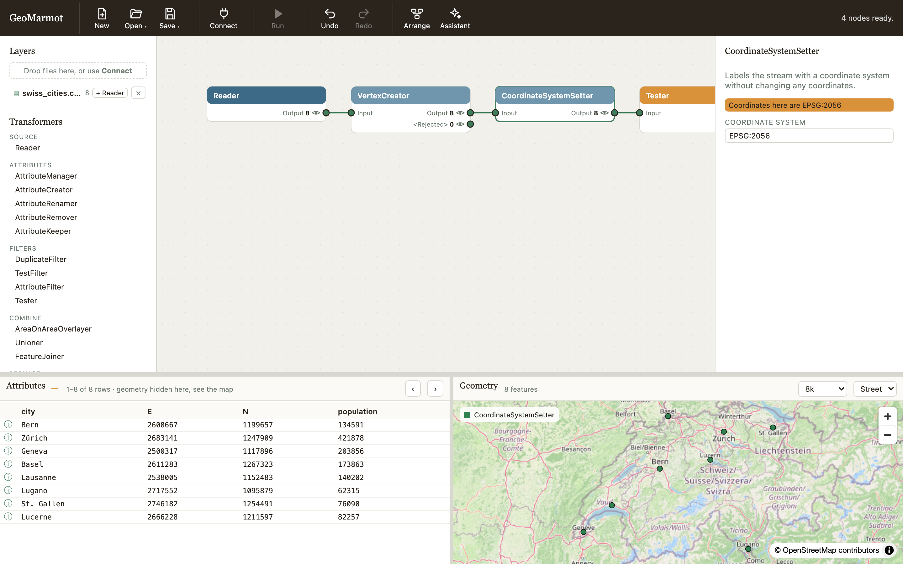
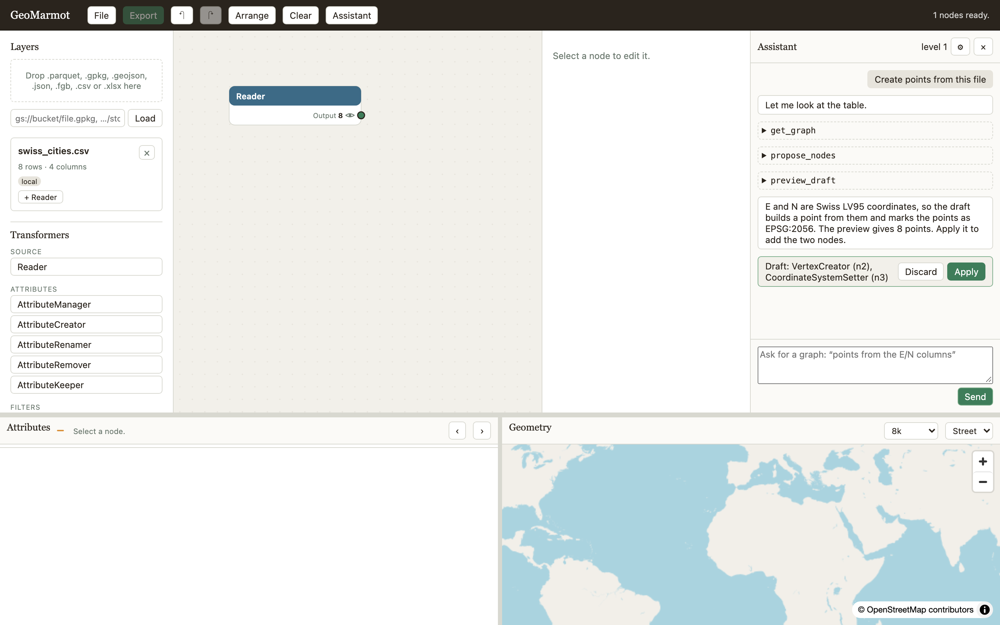

# GeoMarmot


> A lightweight, web-based spatial ETL. Wire transformers on a canvas and watch your data flow,
> all in your browser.

GeoMarmot is a browser-native spatial ETL workbench. DuckDB-Wasm does the work in your own tab:
files you open are never uploaded, and remote files are read with HTTP range requests, so only the
parts a query needs are downloaded.



## Why GeoMarmot

GeoMarmot comes out of years of building spatial ETL pipelines with proprietary tools. Those tools
are powerful, but closed, expensive, and slow to change. AI-assisted development has changed what a
small open-source project can do: transformers, readers and fixes can now be written, tested and
reviewed quickly, so an open spatial ETL can grow and improve with its community rather than wait
on a vendor. GeoMarmot is built to be extended that way — every transformer is one small folder
with its tests and documentation, and the rules are written down for people and coding agents
alike ([CONTRIBUTING](CONTRIBUTING.md)).

## Why a marmot?

- **Small and light.** Spatial ETL usually means a heavy desktop suite, a licence server or a
  spatial database to set up. GeoMarmot is a web page: the geoprocessing runs in your browser tab,
  with DuckDB spatial, GDAL and PROJ built in.
- **It digs tunnels through the terrain.** A marmot's burrow is a network of tunnels under the
  landscape; a GeoMarmot graph is a network of tunnels your layers flow through — read, reproject,
  overlay, buffer, aggregate to H3, write out — one transformer to the next.
- **It doesn't try to be a whole GIS, and it doesn't disturb anything.** No digitising, no map
  layout, no cartography: it moves and transforms spatial data, and leaves the rest to your GIS. In
  return it touches nothing: no install, no server to run, no database to load, and your datasets
  never leave your machine.
- **It knows when to rest.** Marmots hibernate. GeoMarmot computes nothing until you look: each
  transformer is a view, woken up only when the table, the map or an export reads it — so a large
  GeoParquet or a whole H3 tile costs only what you actually draw or write.
- **It whistles when something is wrong.** A marmot whistles to warn the colony. GeoMarmot warns
  when coordinates are not what they claim to be — a projected layer with no CRS, two inputs in
  different coordinate systems — before a wrong map or a wrong export does.

## What it does

- **Transformers** for attributes, filters, joins and overlays, reshaping, geometry, analysis and
  H3 — each one a DuckDB view per output port, so nothing is computed until you look at it.
- **Common spatial and tabular formats**, read from your disk, a URL or a cloud bucket, and written
  back out ([formats](docs/formats.md)).
- **Coordinate systems** are tracked through the graph; the map draws lon/lat and anything PROJ can
  bring back to it.
- **Save your work** as a file on your computer, or as named workspaces kept in the browser
  ([using GeoMarmot](docs/using.md)).
- **Works offline** once installed: every dependency and DuckDB extension ships with the app.
- **An optional assistant** builds graphs from a request, with Claude or OpenAI models. It proposes
  a draft you preview and apply; you choose what it may see of your data, and by default that is
  column names and types only ([security](docs/security.md)).



## Run it

GeoMarmot is not published as a package. There are two ways to use it.

### 1. In your browser, at the hosted demo

Open **<https://regislon.github.io/geomarmot/demo/>**. Nothing to install: the app runs entirely in your
tab, and the files you open stay on your machine. The hosted copy has no server behind it, so
buckets are read there with a Google sign-in instead of your gcloud credentials; the assistant works with an API key
you type into its settings.

### 2. From a clone of the repository

You need Node 22 and, for the local server, [uv](https://docs.astral.sh/uv/).

```bash
git clone https://github.com/regislon/geomarmot.git
cd geomarmot
npm ci
npm run build
cd server && uv run geomarmot    # opens http://127.0.0.1:8765 in your browser
```

The local server adds what a browser cannot do alone: reading `gs://` buckets with your own cloud
credentials, browsing buckets, and letting the assistant use a key from your environment
(`ANTHROPIC_API_KEY` or `OPENAI_API_KEY`) instead of one typed into the page. It only listens on
127.0.0.1 and refuses any other Host: remote access is not supported.

To build and run it as a container instead:

```bash
docker build -t geomarmot .
docker run --rm -p 127.0.0.1:8080:8080 geomarmot
```

Open the link the container prints.

## Develop

```bash
npm ci
npm run dev                # Vite on http://localhost:5173
npm run check              # lint, types, unit tests and the repository gates
npm run test:browser       # every browser suite, in Chromium
```

Adding a transformer takes three files and about ten minutes: see [CONTRIBUTING.md](CONTRIBUTING.md).
Coding agents start from [AGENTS.md](AGENTS.md).

| | |
|---|---|
| [Using GeoMarmot](docs/using.md) | the toolbar, saving and opening, running the Writers, the assistant |
| [Architecture](docs/architecture.md) | how a file becomes a view, generations and leases, the assistant |
| [Transformer API](docs/transformer-api.md) and [params](docs/params.md) | the contract every transformer follows |
| [Engines](docs/engines.md) | DuckDB-Wasm, GDAL, JSTS, h3-js, zarrita, SheetJS — and their limits |
| [Formats](docs/formats.md) | what reads and writes what, and how |
| [Security and privacy](docs/security.md) | the local server, the SQL boundary, the assistant's data levels |
| [Parity](docs/parity.md), [debt](docs/debt.md) | what was kept from the original app, and what is left to do |

## Licence

Apache-2.0. See [LICENSE](LICENSE) and [NOTICE](NOTICE).
